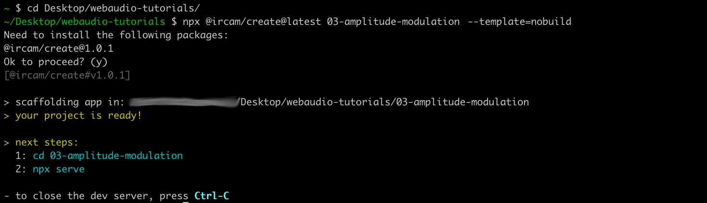

<script setup>
import { withBase } from 'vitepress'
</script>

# Amplitude Modulation Synthesis

In this tutorial, we will explore another very common synthesis technique: the Amplitude Modulation (AM) synthesis.

### Related Documentation

- [@ircam/create](https://github.com/ircam-ismm/ircam-create)
- [`OscillatorNode`](https://developer.mozilla.org/en-US/docs/Web/API/OscillatorNode)
- [`GainNode`](https://developer.mozilla.org/en-US/docs/Web/API/GainNode)
- [`AudioParam`](https://developer.mozilla.org/en-US/docs/Web/API/AudioParam)
- [lit](https://lit.dev/)
- [@ircam/sc-components](https://ircam-ismm.github.io/sc-components/)

## Scaffold the project automatically

First, let's start with scaffolding our project once again. This time, instead of manually create all files and linking them together, we will just use a simple tool that will do all the boring stuff for us.

Open a `Terminal` and go into your projects directory:

```sh
cd Desktop/webaudio-tutorials
```

Then run the following command to scaffold the project:

```sh
npx @ircam/create@latest 03-amplitude-modulation --template=nobuild
```

The `npx` will tell you that you need to install something, just press "Enter" to continue:



If you open the directory that have been created by the tool in your text editor, you should see the following structure and files:

```sh
03-amplitude-modules
├── assets              # Directory to store assets of your project (e.g. sound files)
│   └── sample.wav      # a test sound file
├── lib                 # Directory where to store some common helpers
│   ├── load-audio-buffer.js
│   └── resume-audio-context.js
├── index.html          # The index file
├── main.js             # Where you will put the JavaScript code
├── README.md           # General info about your application
└── styles.css          # The CSS file
```

The project is very close from what we have done manually so far, except that it already contains the code required to resume the audio context, to load sound files, as well as some default CSS to make it nicer to look.

Before digging a bit more into the code, let's just follow the "next steps" instructions given by the tool to make sure everything works as expected:

```sh
cd 03-amplitude-modulation
npx serve
```


As you can see, the server has been launched into our project, just as before. If you then open [http://localhost:3000](http://localhost:3000), you should see a initialization page with a big button to resume the context:


And, after a click on the button:


## Using `import` and libraries

Let's open the `main.js` file to explore how the project is structured:

```js
// main.js
import { html, render } from 'https://unpkg.com/lit-html';
import 'https://unpkg.com/@ircam/sc-components@latest';

import resumeAudioContext from './lib/resume-audio-context.js';
import loadAudioBuffer from './lib/load-audio-buffer.js';

const audioContext = new AudioContext();
await resumeAudioContext(audioContext);

const buffer = await loadAudioBuffer('./assets/sample.wav', audioContext.sampleRate);

render(html`
  <h1>03-amplitude-modulation</h1>
  <sc-bang
    @input=${e => {
      const src = audioContext.createBufferSource();
      src.connect(audioContext.destination);
      src.buffer = buffer;
      src.start();
    }}
  ></sc-bang>
`, document.body);
```

As you can see, while some things may appear quite similar to what we have already done in previous tutorials, there are also a few new things that we need to understand.

The most important are the first lines, which begin with `import`, let's just concentrate on one of the two last imports to understand what is going on there:

```js {5}
import { html, render } from 'https://unpkg.com/lit-html';
import 'https://unpkg.com/@ircam/sc-components@latest';

import resumeAudioContext from './lib/resume-audio-context.js';
import loadAudioBuffer from './lib/load-audio-buffer.js';
```

If we detail this, we can understand that our code "imports" something called `loadAudioBuffer` from a relative location: `'./lib/load-audio-buffer.js'`. Interestingly, this location corresponds to the `load-audio-buffer.js` file located inside the `lib` directory. Let's just open this file to understand what our code actually imports:

```js
// ./lib/load-audio-buffer.js
export default async function loadAudioBuffer(pathname, sampleRate = 48000) {
  // ...
  const response = await fetch(pathname);
  const arrayBuffer = await response.arrayBuffer();
  // ...
  const audioBuffer = await context.decodeAudioData(arrayBuffer);

  return audioBuffer;
}
```

Except some particularities that have been removed from the snippet above, you can see that this file "exports" a function called `loadAudioBuffer` which contains more or less the same code you wrote in the last tutorial to load an audio file from the network and to decode it to an [`AudioBuffer`](https://developer.mozilla.org/en-US/docs/Web/API/AudioBuffer).

These `import` and `export` statements are the tools JavaScript gives us to organize our projects. Moreover, they also allows us to load libraries directly from the Web, cf. the first two `import` and thus share functionalities between several projects. For example, the two libraries that are imported in the first two lines will help us creating the user interfaces more simply.

## Create the audio graph

Now that everything is ready and that you have an understanding of the structure of the project, let's write our AM synthesis engine. The main principle of AM synthesis is to modulate the amplitude (i.e. the gain) of a signal, called the "carrier", with another "modulating" signal.

::: info
We won't go into the details of how amplitude modulation works here, so if you are not familiar with how AM synthesis works, you can find a number of resources online such as on [Wikipedia](https://en.wikipedia.org/wiki/Amplitude_modulation)
:::

As we will only use [`OscillatorNode`](https://developer.mozilla.org/en-US/docs/Web/API/OscillatorNode) here, let's start with cleaning a bit our `main.js` file to remove the things we won't use:

```js
import { html, render } from 'https://unpkg.com/lit-html';
import 'https://unpkg.com/@ircam/sc-components@latest';

import resumeAudioContext from './lib/resume-audio-context.js';
import loadAudioBuffer from './lib/load-audio-buffer.js'; // [!code --]

const audioContext = new AudioContext();
await resumeAudioContext(audioContext);

const buffer = await loadAudioBuffer('./assets/sample.wav', audioContext.sampleRate);  // [!code --]

render(html`
  <h1>03-amplitude-modulation</h1>
  <sc-bang   // [!code --]
    @input=${e => {  // [!code --]
      const src = audioContext.createBufferSource();  // [!code --]
      src.connect(audioContext.destination);  // [!code --]
      src.buffer = buffer;  // [!code --]
      src.start();  // [!code --]
    }}  // [!code --]
  ></sc-bang> // [!code --]
`, document.body);
```

which leaves us with an even more simple structure:

```js
import { html, render } from 'https://unpkg.com/lit-html';
import 'https://unpkg.com/@ircam/sc-components@latest';

import resumeAudioContext from './lib/resume-audio-context.js';

const audioContext = new AudioContext();
await resumeAudioContext(audioContext);

render(html`
  <h1>03-amplitude-modulation</h1>
`, document.body);
```

Then let's first define some constant for our synthesizer:

```js {4-6}
const audioContext = new AudioContext();
await resumeAudioContext(audioContext);

const amDepth = 1; // how much the carrier is modulated: [0, 1]
const amFrequency = 2; // in Hz
const carrierFrequency = 200; // in Hz
```

Then, let's define our "carrier" oscillator and the gain that will be modulated to create the modulating envelop:

```js {3-14}
const carrierFrequency = 200; // in Hz

// carrier signal
const carrier = audioContext.createOscillator();
carrier.frequency.value = carrierFrequency;

const envelop = audioContext.createGain();

// connect them all together
carrier.connect(envelop)
envelop.connect(audioContext.destination);

// start the sources
carrier.start();
```

If you reload the page now, you should ear a simple sine oscillator at 200Hz.

Let's now implement the modulating branch of our synthesizer. What we want to obtain here is a amplitude signal which has the form of a sine wave at 2Hz (the `amFrequency` value), and comprised between 0 and 1 (the `amDepth` value).


To achieve this using only [`OscillatorNode`](https://developer.mozilla.org/en-US/docs/Web/API/OscillatorNode) (which produces a signal between `-1` and `1`) and a [`GainNode`](https://developer.mozilla.org/en-US/docs/Web/API/GainNode) (which basically apply a multiplication on an incoming signal), we will need two steps:

- Apply a gain of 0.5 (i.e. `amDepth / 2`) on an oscillator, producing a sin comprised between `-0.5` and `0.5`
- Then add a constant value of `0.5` (i.e. `1 - amDepth / 2`) to this scaled signal

In terms of audio graph, this will be achieved by connecting the scaled signal to the `gain` property of a `GainNode` (which is an instance of [`AudioParam`](https://developer.mozilla.org/en-US/docs/Web/API/AudioParam)), which will add the modulating signal to the `gain` intrisic value, as show in the graph below:


In terms of code, the first step is quite straight forward, it is basically creating an oscillator and piping it into a gain:

```js {3-10,14}
envelop.connect(audioContext.destination);

// modullating branch
const modulator = audioContext.createOscillator();
modulator.frequency.value = amFrequency;

const depth = audioContext.createGain();
depth.gain.value = amDepth / 2;

modulator.connect(depth); // signal between [-0.5, 0.5]

// start the sources
carrier.start();
modulator.start();
```

The second step, to add an offset to the scaled signal, requires us to use a interesting feature of [`AudioParam`](https://developer.mozilla.org/en-US/docs/Web/API/AudioParam)s. Indeed, the Web Audio API allows us to directly modulate an [`AudioParam`](https://developer.mozilla.org/en-US/docs/Web/API/AudioParam), for example the `gain` of our `envelop` node, with another signal. When connecting a node to a audio param, the signal of the node is "added" to the signal intrinsically produced by the audio param.

In other words, if we set the `gain` of our `envelop` to 0.5, the gain `AudioParam` produces a constant signal at `0.5`, which is used to multiply the input signal of the `GainNode`. But if we modulate our gain `AudioParam`, and therefore its constant signal a `0.5` with the scaled signal we just created with the `modulator` and `depth` node. The constant signal of the gain `AudioParam` and our scaled signal will just be added together, producing a sine wave comprised between `0` and `1`.

In the code, this just means:

```js
// carrier signal
const carrier = audioContext.createOscillator();
carrier.frequency.value = carrierFrequency;

const envelop = audioContext.createGain();
envelop.gain.value = 1 - amDepth / 2; // set to the offset we want (i.e. 0.5) // [!code ++]

// connect them all together
carrier.connect(envelop)
envelop.connect(audioContext.destination);

// modulating branch
const modulator = audioContext.createOscillator();
modulator.frequency.value = amFrequency;

const depth = audioContext.createGain();
depth.gain.value = amDepth / 2;

modulator.connect(depth); // signal between [-0.5, 0.5]
depth.connect(envelop.gain); // adds our scaled signal with audio param signal // [!code ++]
```


You reload the page now, you should ear a simple tremolo at 2Hz applied to the carrier frequency at 200Hz.

<audio controls loop :src="withBase('/static-assets/am-tremolo-2hz.m4a')"></audio>

Congrats, you have written your first little synthesizer!

## Create the user interface

Now that the guts of our synthesizer is ready, let's create the user interface that will allow to manipulate its different params, i.e. `amDepth`, `amFrequency`, `carrierFrequency`.

To that end we will use the two libraries that are imported on the top of our file:

```js
import { html, render } from 'https://unpkg.com/lit-html';
import 'https://unpkg.com/@ircam/sc-components@latest';
```

The first one, the [`lit`](https://lit.dev/) library is what is called a template engine. Without going into detail, let's consider this library allows us to write our HTML code in a simple manner directly from the JavaScript, e.g. the following lines in our `main.js` file:

```js
render(html`
  <h1>03-amplitude-modulation</h1>
`, document.body);
```

are the one that created the `<h1>` tag that we can use in the browser since the beginning of this tutorial:


The second library, [`@ircam/sc-components`](https://ircam-ismm.github.io/sc-components/), is a library that provides  high-level graphical components for rapid prototyping audio application (...which interestingly seems to be perfect for us)

Let's first add some code and interface so that we can control our carrier frequency:

```js {3-13}
render(html`
  <h1>03-amplitude-modulation</h1>
  <div>
    <sc-text>carrier frequency</sc-text>
    <sc-slider
      min="20"
      max="5000"
      step="1"
      number-box
      value=${carrierFrequency}
      @input=${e => { carrier.frequency.value = e.detail.value; } }
    ></sc-slider>
  </div>
`, document.body);
```

If you reload, you should now see a nice slider allowing you to control the frequency of the carrier oscillator:


Second, let's add another slider to control the modulation frequency:

```js {14-24}
render(html`
  <h1>03-amplitude-modulation</h1>
  <div>
    <sc-text>carrier frequency</sc-text>
    <sc-slider
      min="20"
      max="5000"
      step="1"
      number-box
      value=${carrierFrequency}
      @input=${e => { carrier.frequency.value = e.detail.value; } }
    ></sc-slider>
  </div>
  <div>
    <sc-text>modulator frequency</sc-text>
    <sc-slider
      min="20"
      max="5000"
      step="1"
      number-box
      value=${amFrequency}
      @input=${e => { modulator.frequency.value = e.detail.value; } }
    ></sc-slider>
  </div>
`, document.body);
```

Now things start to get more interesting, as you can already explore the large number of sounds such a simple synthesizer can produce!


## Going further

As an exercise, we let you add the last control over the AM depth. This last control is a bit more complex as it will have to update both `envelop.gain` and `depth.gain` so that the sum of the two signal always has a max value of one (...all the necessary information are present in the tutorial to do it properly).

Another interesting exercise could be to implement a Frequency Modulation synthesizer, which rely on the same concepts as the one developed in this tutorial.

## Conclusion

In this tutorial, you have learned how to build more complex audio graph where a signal modulates the parameter of another node (see also FM synthesis). Along the way we have used a more advanced tool to scaffold our application, and libraries to help us create interfaces in a more simple manner.

In the next tutorial, we will learn some concept of object oriented programming and encapsulation, which will help us to organize our code and to create reusable audio components.


