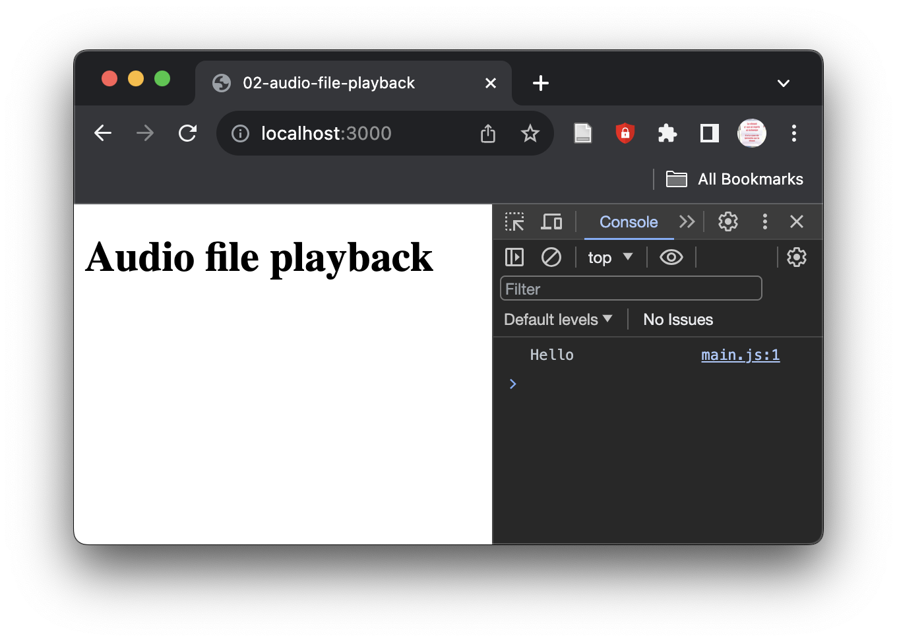
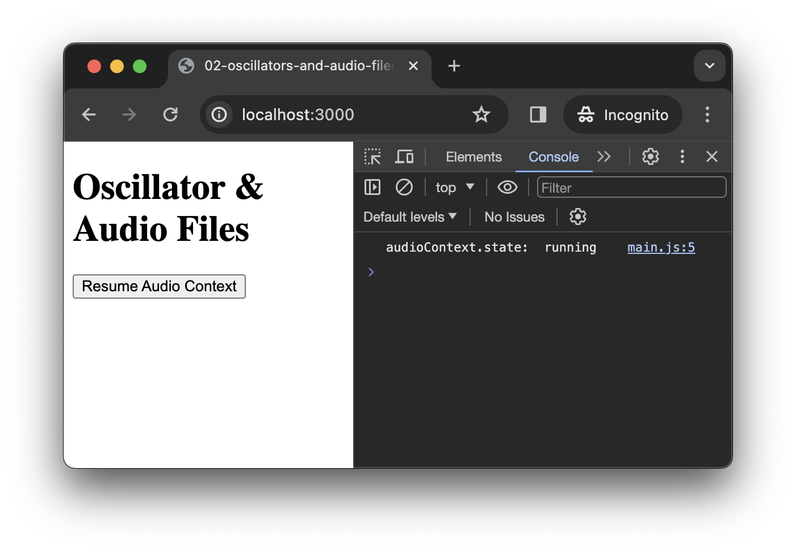
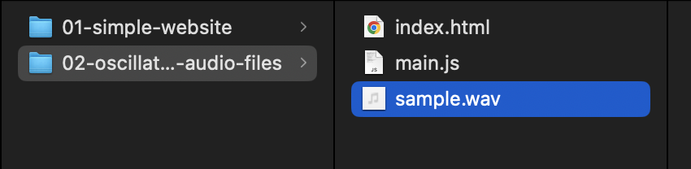

<script setup>
import { withBase } from 'vitepress'
</script>

# Oscillators and Audio Files

In this tutorial, we will learn how to use some basic building blocks of the Web Audio API.

### Related Documentation

- [`AudioContext`](https://developer.mozilla.org/en-US/docs/Web/API/AudioContext)
- [`OscillatorNode`](https://developer.mozilla.org/en-US/docs/Web/API/OscillatorNode)
- [`GainNode`](https://developer.mozilla.org/en-US/docs/Web/API/GainNode)
- [`AudioBufferSourceNode`](https://developer.mozilla.org/en-US/docs/Web/API/AudioBufferSourceNode)
- [`AudioBuffer`](https://developer.mozilla.org/en-US/docs/Web/API/AudioBuffer)

## Setting up the project

Let's start with creating a new project, open a `Terminal` and write the following command to create the tutorial directory:

```sh
mkdir -p ~/Desktop/webaudio-tutorials/02-oscillators-and-audio-files
```

Press `Enter` to execute the command, then go to the directory:

```sh
cd ~/Desktop/webaudio-tutorials/02-oscillators-and-audio-files
```

And start the server

```sh
npx serve
```


Then open the directory in your text editor, and create an HTML file called `index.html` with the following content:

```html {7}
<!DOCTYPE html>
<html>
<head>
  <meta charset="utf-8">
  <meta name="viewport" content="width=device-width, initial-scale=1">
  <title>02-oscillators-and-audio-files</title>
  <script defer type="module" src="./main.js"></script>
</head>
<body>
  <h1>Oscillator & Audio Files</h1>
</body>
</html>
```

As you can see in the highlighted line, the HTML will try to import a JavaScript file called `main.js`, so let's create this `main.js` file with the following content:

```js
console.log('Hello');
```

If you open a Web browser at [http://localhost:3000](http://localhost:3000), and open the JavaScript console, you should see the following:



## Creating and resuming the `AudioContext`

As described in the [previous step](./web-audio-api-introduction.md) a Web Audio graph is always created within an [`AudioContext`](https://developer.mozilla.org/en-US/docs/Web/API/AudioContext).

So let's first create our first `AudioContext`:

```js
// main.js
const audioContext = new AudioContext();
```

::: tip
The first line in the snippet above, i.e. `// main.js` is not meant to be added to the code, but just to remind you in which file the snippet is located. 
The way the line will be written will differ according to the language of the file but will always correspond to a comment in this language, e.g.:
- In JavaScript you will see something like: `// main.js`
- In HTML you will see something like: `<!-- index.html -->`
- In CSS you will see something like: `/* style.css */`

We will often use this convention in these tutorials.
:::

In this snippet, we create new instance of `AudioContext` that we store into a variable called `audioContext`.

By default, a new `AudioContext` is always created with a "suspended" state, which means that no audio will be produced even if asked gently. To "resume" the state, we will need to call a specific method, i.e. `audioContext.resume`, which much be called when the user interact with the page. This restriction is primarily made to prevent Web browser to play some sound (e.g. for advertising...) each time you open a Web page.

Then let's first add a button in our HTML file, that we will use to active the context.

```html {4-6}
<!-- index.html -->
<body>
  <h1>Oscillator & Audio Files</h1>
  <button id="resume-context">
    Resume Audio Context
  </button>
</body>
```

Then in the JavaScript, we can listen for an 'click' event from the user on this button to resume our `AudioContext`:

```js {4-15}
// main.js
const audioContext = new AudioContext();

// grab a JavaScript representation to the HTML button with id "resume-context"
const resumeButton = document.querySelector('#resume-context');

// define a function to be executed when the user click on the button
async function resumeContext() {
  await audioContext.resume();
  console.log('audioContext.state:', audioContext.state);
}

// register the `resumeContext` as a callback to be executed
// when the clicks on the button
resumeButton.addEventListener('click', resumeContext);
```

::: tip
The `async` and `await` keyword that you see in the declaration of the `resumeContext` function refer to what is called _asynchronous operations_. Without going into much detail, you can think of asynchronous operations as operations that have to deal with the underlying system and may take a time that is unknown, e.g. downloading a file is an asynchronous operation as the time it takes to download a file may differ depending of the weight of the file, of the quality of your internet connection, etc.

The `audioContext.resume()` call is asynchronous because the browser needs to ask the system access the sound card and to open a new high priority process (or _thread_) in which the audio will be computed. The `await` keyword just means that we wait for the command to be executed before executing the next line of code.

You will see a lot of asynchronous code when using JavaScript so it's important to understand this concept a bit.
:::

If you click on the button, you should see the log appear in the console confirming that the status of the `audioContext` is now "running", which means everything is ready to produce some sounds.



## Using the `OscillatorNode`

Now that our context is "running", we can use it to play actual sounds with the Web Audio API. Let's start with the a simple [`OscillatorNode`](https://developer.mozilla.org/en-US/docs/Web/API/OscillatorNode)

Let's first add another button into our HTML 

```html {5-7}
<!-- index.html -->
<button id="resume-context">
  Resume Audio Context
</button>
<button id="trigger-osc">
  Trigger Oscillator
</button>
```

And grab a reference to it in the JavaScript, as we did for the `#resume-context` button:

```js {3}
// main.js
const resumeButton = document.querySelector('#resume-context');
const triggerOscButton = document.querySelector('#trigger-osc');
```

Then, we can create and start a new `OscillatorNode` each time the user clicks on the button. 

```js {4-15}
// main.js
resumeButton.addEventListener('click', resumeContext);

// function that creates and start a new oscillator
function triggerOsc() {
  // create a new oscillator
  const osc = audioContext.createOscillator();
  // connect it to the audio output, i.e. the `DestinationNode`
  osc.connect(audioContext.destination);
  // start the oscillator as fast as we can
  osc.start();
}

// create an oscillator each time the button is clicked
triggerOscButton.addEventListener('click', triggerOsc);
```

::: info
Remember that each time you reload the page, you face a brand new `AudioContext`, therefore don't forget to click on the "resume context" button first.
:::

### Setting the frequency

If you click several time on the button, you will hear the sound slightly changing. Indeed each time you click the button, you create a new oscillator with default frequency (i.e. 440Hz), which produces phasing and distortion effects when they pile up.

Let's change a bit our `triggerOsc` function to modify the frequency of each of the oscillators:

```js
// create a new oscillator
const osc = audioContext.createOscillator();
// pick a random frequency between 100 and 1000 Hz // [!code ++]
const freq = 100 + Math.random() * 900; // [!code ++]
// apply this frequency to oscillator // [!code ++]
osc.frequency.value = freq; // [!code ++]
// connect it to the audio output, i.e. the `DestinationNode`
osc.connect(audioContext.destination);
// start the oscillator as fast as we can
osc.start();
```

If you reload the page, resume the context and click on the button you will now hear the different oscillators piling up at different frequency. The sound will still get distorted at some point but at least you can hear the effect of triggering these oscillator.

When we added this line:

```js
osc.frequency.value = freq;
```

We actually changed an [`AudioParam`](https://developer.mozilla.org/en-US/docs/Web/API/AudioParam) called `frequency` that is linked to the oscillator. Most `AudioNode`s have such parameters that allows to modify their behavior and create automation.

### Adding an envelop

To dig a bit more into `AudioParam`s, let's modify our `triggerOsc` function to use a [`GainNode`](https://developer.mozilla.org/en-US/docs/Web/API/GainNode) in order to add an envelop to each of our oscillators

```js
// create a gain node and set its gain value to 0 // [!code ++]
const env = audioContext.createGain(); // [!code ++]
env.gain.value = 0; // [!code ++]
// start the oscillator as fast as we can
osc.start();
```

Then we need to schedule automation, here we will for example make a linear ramp from 0 to 1 in 10 ms and then go from 1 to 0 in ~1 sec.

```js
// create a gain node and set its gain value to 0
const env = audioContext.createGain();
env.gain.value = 0;
// pick the context current time in seconds // [!code ++]
const now = audioContext.currentTime; // [!code ++]
env.gain.setValueAtTime(0, now); // create an automation point // [!code ++]
env.gain.linearRampToValueAtTime(1, now + 0.01) // ramp to 1 in 10 ms // [!code ++]
env.gain.linearRampToValueAtTime(0, now + 1) // ramp to 0 in 1 sec // [!code ++]
```

Then let's modify how the graph is created to pipe the oscillator into the envelop before sending it to destination:

```js
// connect it to the audio output, i.e. the `DestinationNode`  // [!code --]
osc.connect(audioContext.destination); // [!code --]
// create a gain node and set its gain value to 0
const env = audioContext.createGain();
env.gain.value = 0;
// pick the context current time in seconds
const now = audioContext.currentTime;
env.gain.setValueAtTime(0, now); // create an automation point
env.gain.linearRampToValueAtTime(1, now + 0.01) // ramp to 1 in 10 ms
env.gain.linearRampToValueAtTime(0, now + 1) // ramp to 0 in 1 sec
// create the graph chain: osc -> env -> output // [!code ++]
osc.connect(env).connect(audioContext.destination); // [!code ++]
```

If you reload the page and trigger some oscillator you should hear the ramp applied to each triggered oscillators. 

However, there is still an issue with our code. Indeed, our oscillators are started but they are never stopped which might lead to waste of resources if click a lot of time on the button. As we know the exact start and end time of our ramp, we can know explicitly control the oscillators so that they start at the beginning of the ramp and stop exactly when the ramp goes back to zero.

```js
// start the oscillator as fast as we can // [!code --]
osc.start(); // [!code --]
// start the oscillator when the ramp start and stop it when // [!code ++]
// it goes back to zero, i.e. 1 sec later // [!code ++]
osc.start(now); // [!code ++]
osc.stop(now + 1); // [!code ++]
```

Finally, let's fix the clipping issue that occur when we trigger multiple oscillators in a short period of time, and make our envelop a little bit nicer:

```js
env.gain.linearRampToValueAtTime(1, now + 0.01); // [!code --]
env.gain.linearRampToValueAtTime(0, now + 1); // [!code --]  
env.gain.linearRampToValueAtTime(0.2, now + 0.01); // ramp to 0.2 in 10 ms // [!code ++]
env.gain.exponentialRampToValueAtTime(0.0001, now + 1); // ramp to 0.0001 in 1 sec // [!code ++]  
```

### Wrap up

At this point, your `index.html` and `main.js` should look like the following

```html
<!-- index.html -->
<!DOCTYPE html>
<html>
<head>
  <meta charset="utf-8">
  <meta name="viewport" content="width=device-width, initial-scale=1">
  <title>02-oscillators-and-audio-files</title>
  <script defer type="module" src="./main.js"></script>
</head>
<body>
  <h1>Oscillator & Audio Files</h1>
  <button id="resume-context">
    Resume Audio Context
  </button>
  <button id="trigger-osc">
    Trigger Oscillator
  </button>
</body>
</html>
```

```js
const audioContext = new AudioContext();

// grab a JavaScript representation to the HTML button with id "resume-context"
const resumeButton = document.querySelector('#resume-context');
const triggerOscButton = document.querySelector('#trigger-osc');

// logic to resume the audio context
async function resumeContext() {
  await audioContext.resume();
  console.log('audioContext.state:', audioContext.state);
}

resumeButton.addEventListener('click', resumeContext);

// logic to trigger oscillators
function triggerOsc() {
  const osc = audioContext.createOscillator();
  const freq = 100 + Math.random() * 900;
  osc.frequency.value = freq;

  const env = audioContext.createGain();
  const now = audioContext.currentTime;
  env.gain.value = 0;
  env.gain.setValueAtTime(0, now); 
  env.gain.linearRampToValueAtTime(0.2, now + 0.01); 
  env.gain.exponentialRampToValueAtTime(0.0001, now + 1);
  osc.connect(env).connect(audioContext.destination);

  osc.start(now);
  osc.stop(now + 1);
}

triggerOscButton.addEventListener('click', triggerOsc);
```

## Using the `AudioBufferSourceNode`

`OscillatorNode`s are really nice indeed, but let's now consider how we can play a sound file using the [`AudioBufferSourceNode`](https://developer.mozilla.org/en-US/docs/Web/API/AudioBufferSourceNode). 

::: info
The sample used in the tutorial can be downloaded <a :href="(withBase('/static-assets/oscillators-and-audio-files.zip'))">here</a>
:::

### Load a sound file

To do so, we will first need to load a file into memory so the Web Audio API can have full control over the playback. Let's then add some sound file into our project directory:



Then add the following code into `main.js` to load a sound file from the network and decode it into an [`AudioBuffer`](https://developer.mozilla.org/en-US/docs/Web/API/AudioBuffer):

```js {2-9}
// main.js
// define a function that load a file from the network and decode
// it into an `AudioBuffer` instance
async function loadAudioBuffer(pathToFile) {
    const response = await fetch(pathToFile);
    const buffer = await response.arrayBuffer();
    const audioBuffer = await audioContext.decodeAudioData(buffer);
    return audioBuffer;
}

async function resumeContext() {
  await audioContext.resume();
  console.log('audioContext.state:', audioContext.state);
}
```

Then let's just execute the function with the path of our file as argument:

```js {8-9}
async function loadAudioBuffer(pathToFile) {
    const response = await fetch(pathToFile);
    const buffer = await response.arrayBuffer();
    const audioBuffer = await audioContext.decodeAudioData(buffer);
    return audioBuffer;
}
// load the file inside our project directory
const buffer = await loadAudioBuffer('./sample.wav');
console.log(buffer);
```

If you reload the page and open the console, you should see the information about the file you loaded logged in the console:


::: info
Note the buffer is properly loaded even if the `AudioContext` has not been resumed yet. This is a pretty handy feature as it allow us to load our audio file(s) when the page is loading, so everything is ready when the user starts to interact with the page.
::: 

### Playback the buffer

Now that we have our `AudioBuffer` ready, let's had a button to trigger its playback into the HTML file:

```html
<!-- index.html -->
<button id="trigger-osc">
Trigger Oscillator
</button> 
<button id="trigger-sound-file">
Trigger Sound File
</button>
```

Just as before with the other buttons, let's grab the JavaScript representation of this new button:

```js
// main.js
const triggerOscButton = document.querySelector('#trigger-osc');
const triggerSoundFileButton = document.querySelector('#trigger-sound-file');
```

And Finally, we can write the code that will play the sound file when the user click on the button:

```js
// main.js
// function that playback the audio buffer we previously loaded
function triggerSoundFile() {
  // create an audio buffer source node
  const src = audioContext.createBufferSource();
  // set it's buffer with the audio buffer we loaded earlier
  src.buffer = buffer;
  // connect the node to the destination
  src.connect(audioContext.destination);
  // start plyaback
  src.start();
}
// playback our audio buffer each time the button is clicked
triggerSoundFileButton.addEventListener('click', triggerSoundFile);
```

Tada! You now have a very powerful button that plays back your sound file each time you click on it.

## Important notes

### Function and listeners syntax

In all this tutorial, we have used the following syntax to register listener for our buttons:

```js
function onClick() { console.log('clicked'); }
myButton.addEventListener('click', onClick);
```

It is important to understand that, in the second line, we actually pass the reference of the function as an argument of the `addEventListener` method. 
The function **is not executed** at this point! This is the browser that will execute the function when the user actually clicks on the button. 

::: info
Such functions are generally called _callbacks_ because we give them to the browser (or to another piece of code), which is in charge of executing it (or calling it back) when "something" happens at some unknown point in the future.
:::

Another way of writing this, would have been therefore to declare the function at the same time we pass it as an argument:

```js
myButton.addEventListener('click', function onClick() { console.log('clicked'); });
```

But, now our line of code starts to be a bit long and hard to read, so we can just insert line breaks to make it a bit more pretty:

```js
myButton.addEventListener('click', function onClick() { 
    console.log('clicked'); 
});
```

But, at this point, we can then wonder why need to give a name to this function, as we are only interested to pass as argument of `addEventListener`. Indeed, we will never have to call this function manually, as it is the responsibility of the browser. So, we can just remove the function name and pass an _anonymous function_:

```js
myButton.addEventListener('click', function() { 
    console.log('clicked'); 
});
```

Finally, yet another way of writing this would be to use the _arrow function_ syntax:

```js
myButton.addEventListener('click', () => { 
    console.log('clicked'); 
});
```

In the reset of these tutorials, we will mostly use the two last syntax which are the most common in JavaScript. So make sure you've understood this note and why these different syntax are (almost) all the same.

### Audio sources behavior

An important point you may have noticed, is that you created a new instance of `OscillatorNode` and `AudioBufferSourceNode` each time you clicked on the button. This is something that is often a bit confusing at first for people which are used to other music programming environment. Indeed, in the Web Audio API paradigm, sources are **not reusable**, once they have been stopped (or stopped themselves in the case of the `AudioBufferSourceNode`), they cannot be restarted again.

In future tutorials, we will see how this feature (that may appear weird) can end up to be very practical and powerful.

## Conclusion

In this tutorial, you have learned how to use some basic building blocks of the Web Audio API. 

Along the way you have learned many different things such as how to resume the audio context with a user interaction, how to load and decode a sound file from the network, how to create automation on audio parameters, as well as important concepts regarding the audio sources in the Web Audio API.

In the next tutorial, we will go a bit further with the creation of an AM synthesizer.


