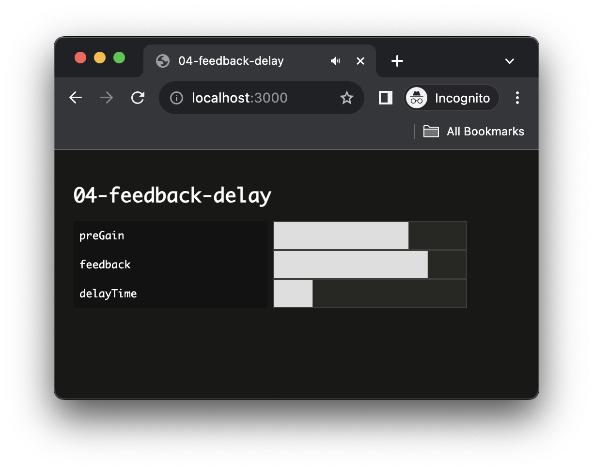

<script setup>
import { withBase } from 'vitepress'
</script>

# Implementing a Reusable Feedback Delay

In this tutorial, we will build on top of the patterns we just reviewed to build a reusable feedback delay effect.

### Related Documentation

- [`setInterval`](https://developer.mozilla.org/docs/Web/API/setInterval)
- [`DelayNode`](https://developer.mozilla.org/docs/Web/API/DelayNode)
- [`setTargetAtTime`](https://developer.mozilla.org/docs/Web/API/AudioParam/setTargetAtTime) 

## Scaffolding project

First things first, let's create a new project using the `@ircam/create` command. Open a `Terminal` and write de following commands

```sh
cd ~/Desktop/webaudio-tutorials
npx @ircam/create@latest 04-feedback-delay
cd 04-feedback-delay
npx serve
```

Then open the `04-feedback-delay` directory in your text editor

::: info
If you are wondering what's going on here, please check the more detailled step by step guide [here](./amplitude-modulation-synthesis.html#scaffold-the-project-automatically)
:::

## Trigger source at regular interval

To test our feeback delay, let's create some source triggered at regular interval. Fortunately, the default project we just created already provides us an `AudioBuffer` which will be perfect to that end.

Then, let's just modify the code so that instead of having to manually trigger the source, it is triggered automatically at a a regular interval, for example every second.

```js
import { html, render } from 'https://unpkg.com/lit-html';
import 'https://unpkg.com/@ircam/sc-components@latest';

import resumeAudioContext from './lib/resume-audio-context.js';
import loadAudioBuffer from './lib/load-audio-buffer.js';

const audioContext = new AudioContext();
await resumeAudioContext(audioContext);

const buffer = await loadAudioBuffer('./assets/sample.wav', audioContext.sampleRate);

setInterval(() => { // [!code ++]
    const src = audioContext.createBufferSource(); // [!code ++]
    src.connect(audioContext.destination); // [!code ++]
    src.buffer = buffer; // [!code ++]
    src.start(); // [!code ++]
}, 1000); // [!code ++]

render(html`
  <h1>04-feedback-delay</h1>
  <sc-bang // [!code --]
    @input=${e => { // [!code --]
      const src = audioContext.createBufferSource(); // [!code --]
      src.connect(audioContext.destination); // [!code --]
      src.buffer = buffer; // [!code --]
      src.start(); // [!code --]
    }} // [!code --]
  ></sc-bang> // [!code --]
`, document.body);
```

If you reload the page you should now ear the following:

<audio controls loop :src="withBase('/static-assets/feedback-delay-trigger.m4a')" />

## Create a module for the FeedbackDelay class

To implement our `FeedbackDelay`, we will create a new module that we will import into our `main.js` file. Create a new file called `FeedbackDelay.js` inside the `lib` directory:

```md {4}
04-feedback-delay
├── assets              
├── lib                 
│   ├── FeedbackDelay.js
│   ├── load-audio-buffer.js
│   └── resume-audio-context.js
├── index.html
├── main.js
├── README.md
└── styles.css
``` 

And write the basic structure of the class and export it as default export:

```js
// ./lib/FeedbackDelay.js
class FeedbackDelay {
  constructor() {
    console.log('FeedbackDelay created!');
  }
}

export default FeedbackDelay;
```

Then, let's import our newly created `FeedbackDelay` class into the `main.js` file and create a new instance to check that everything works as expected:

```js {4,10}
// main.js
import resumeAudioContext from './lib/resume-audio-context.js';
import loadAudioBuffer from './lib/load-audio-buffer.js';
import FeedbackDelay from './lib/FeedbackDelay.js';

const audioContext = new AudioContext();
await resumeAudioContext(audioContext);

const buffer = await loadAudioBuffer('./assets/sample.wav', audioContext.sampleRate);
const delay = new FeedbackDelay();
```

If you reload the page, you should see the log appear from the `FeedbackDelay` constructor in the console:


Before going into the implementation of the actual audio graph of the delay, we can already see an issue with our code. Our feedback delay will very probably have to create some nodes to process the audio stream, but our `AudioContext` only lives in the `main.js` "context".

Let's just fix that by passing our resumed `AudioContext` to the `FeedbackDelay` when we instantiate it. And while we are here, let's pass it also an object as second argument that will allow us to configure it later:

```js
// main.js
const delay = new FeedbackDelay(); // [!code --]
const delay = new FeedbackDelay(audioContext, {}); // [!code ++]
```

```js
// ./lib/FeedbackDelay.js
class FeedbackDelay {
  constructor(audioContext, options = {}) {
    console.log('FeedbackDelay created!'); // [!code --]
    // store the audioContext instance inside the FeedbackDelay instance // [!code ++]
    this.audioContext = audioContext; // [!code ++]
    // prepare logic for handling configuration options // [!code ++]
    this.options = Object.assign({}, options); // [!code ++]
  }
}
```

## Connecting to the audio graph

So far so good, we have our `FeedbackDelay` instance created, by it is not yet inserted into our audio graph. Indeed, for now our `AudioBufferSourceNode` is directly connected to the `destination`, while we would like connect it to our delay, which itself should be connected to the destination, such as:


As our `FeedbackDelay` is not a full featured native `AudioNode`, let's consider it will expose two `AudioNode` attributes, which we will be called `input` and `output`, to which native `AudioNode` can connect, or on which they can be connected.

So, let's start by modifying our `main.js` file to insert our feedback delay between the source and the destination:

```js
const buffer = await loadAudioBuffer('./assets/sample.wav', audioContext.sampleRate);
const delay = new FeedbackDelay(audioContext, {});
delay.output.connect(audioContext.destination); // [!code ++]

setInterval(() => {
    const src = audioContext.createBufferSource();
    src.connect(audioContext.destination); // [!code --]
    src.connect(delay.input); // [!code ++]
    src.buffer = buffer;
    src.start();
}, 1000);
```

Of course if you try to reload now, you will run into the following error

```
Uncaught TypeError: Cannot read properties of undefined (reading 'connect')
```

Indeed, the line:

```js
// main.js
delay.output.connect(audioContext.destination);
```` 

tries to call some `connect` method on something that is not defined into our `FeedbackDelay` class. So let's fix this issue, by creating the `input` and `output` nodes of our `FeedbackDelay`:

```js {}
// ./lib/FeedbackDelay.js
class FeedbackDelay {
  constructor(audioContext, options = {}) {
    // store the audioContext instance inside the FeedbackDelay instance
    this.audioContext = audioContext;
    // prepare logic for handling configuration options
    this.options = Object.assign({}, options);

    this.input = this.audioContext.createGain(); 
    this.output = this.audioContext.createGain();
  }
}
```

Ok, now that our `FeedbackDelay` expose an `input` and an `output` attribute, which are both `AudioNode`, the code should not complain anymore. Then, if you reload your page, you should see that all errors disappeared. 

But all sound as well... This is because inside our `FeedbackDelay` class the `input` and `output` are not connected together. Let's fix that with implementing our feedback delay for good.

## Implement the internal audio graph

The internal graph of our `FeedbackDelay` will look like the following, with direct connection between the input and output to propagate the direct signal, and branch containing the delay itself with its feedback loop.


Let's thus implement this graph into our `FeedbackDelay` class:

```js {8-10,13-36}
// ./lib/FeedbackDelay.js
class FeedbackDelay {
  constructor(audioContext, options = {}) {
    // store the audioContext instance inside the FeedbackDelay instance
    this.audioContext = audioContext;
    // define default parameter values that can be overriden with options
    this.options = Object.assign({
      preGain: 0.7,
      delayTime: 0.2,
      feedback: 0.8,
    }, options);

    /* Setup audio nodes */
    // input / ouput node
    this.input = this.audioContext.createGain();
    this.output = this.audioContext.createGain();
    // feedback loop nodes
    this.preGain = this.audioContext.createGain();
    this.preGain.gain.value = this.options.preGain;
    
    this.delay = this.audioContext.createDelay(1); // "1" is the maximum delay time
    this.delay.delayTime.value = this.options.delayTime;

    this.feedback = this.audioContext.createGain();
    this.feedback.gain.value = this.options.feedback;

    /* Setup connections */
    // direct signal
    this.input.connect(this.output);
    // direct delay line
    this.input.connect(this.preGain);
    this.preGain.connect(this.delay);
    this.delay.connect(this.output);
    // feedback loop
    this.delay.connect(this.feedback);
    this.feedback.connect(this.delay);
  }
}

export default FeedbackDelay;
```

Tada! I you reload now, you will be able to ear the feedback delay line in action:

<audio controls loop :src="withBase('/static-assets/feedback-delay-full.m4a')" />

::: info
You can hear that the overlap between the delay line and a new triggering of a source is not very clean, while it should be as we trigger a new sound every 1s and our `delayTime` is 0.2s. This is due to how we trigger our source. Indeed using `setInterval` as we did in first step is generally not a good idea in audio applications as this timer is not precise enough. In the next tutorials we will learn how to overcome such timing issues.
:::

## User interface

Before concluding this tutorial, let's add some graphical user interface (GUI) to control our feedback delay parameters. First, we will define new methods in our `FeedbackDelay` class to hide the internals from the main code:

```js {7-23}
// ./lib/FeedbackDelay.js
class FeedbackDelay {
  constructor(audioContext, options = {}) {
    // ...
  }

  setPreGain(value) {
    const timeConstant = 0.01;
    const currentTime = this.audioContext.currentTime;
    this.preGain.gain.setTargetAtTime(value, currentTime, timeConstant);
  }

  setFeedback(value) {
    const timeConstant = 0.01;
    const currentTime = this.audioContext.currentTime;
    this.feedback.gain.setTargetAtTime(value, currentTime, timeConstant);
  }

  setDelayTime(value) {
    const timeConstant = 0.01;
    const currentTime = this.audioContext.currentTime;
    this.delay.delayTime.setTargetAtTime(value, currentTime, timeConstant);
  }
}
```

::: tip
As you can see, this time we used the [`setTargetAtTime`](https://developer.mozilla.org/en-US/docs/Web/API/AudioParam/setTargetAtTime) automation method of the `AudioParam` we want to update. Indeed, using this automation method, instead of `param.value = newValue` as we did until now, will protect us from discontinuities in the computation of the audio signal, preventings all sorts of click and pops.
::: 

Now that everything is ready in our `FeedbackDelay` class, let's just create our user interface:

```js {4-24}
// main.js
render(html`
  <h1>04-feedback-delay</h1>
  <div>
    <sc-text>preGain</sc-text>
    <sc-slider
      value=${delay.options.preGain}
      @input=${e => delay.setPreGain(e.detail.value)}
    ></sc-slider>
  </div>
  <div>
    <sc-text>feedback</sc-text>
    <sc-slider
      value=${delay.options.feedback}
      @input=${e => delay.setFeedback(e.detail.value)}
    ></sc-slider>
  </div>
  <div>
    <sc-text>delayTime</sc-text>
    <sc-slider
      value=${delay.options.delayTime}
      @input=${e => delay.setDelayTime(e.detail.value)}
    ></sc-slider>
  </div>
`, document.body);
```

And done! If you reload your page, you should now see the interface and should be able to play with the parameters of your feedback delay:



## Conclusion

In this tutorial, you have created an abstract and reusable audio effect using JavaScript classes and modules. With such pattern, you can envision reusing this effect in another project very easily by just copy / paste the file and importing it, or even start creating your own library of audio effects!

In the next tutorials, we will focus on how to fix the issue we have seen with innacuracy of the `setInterval` during this tutorial. Properly understand this timing issue and how to fix them is a key element to build more advanced synthesis methods and audio applications.


