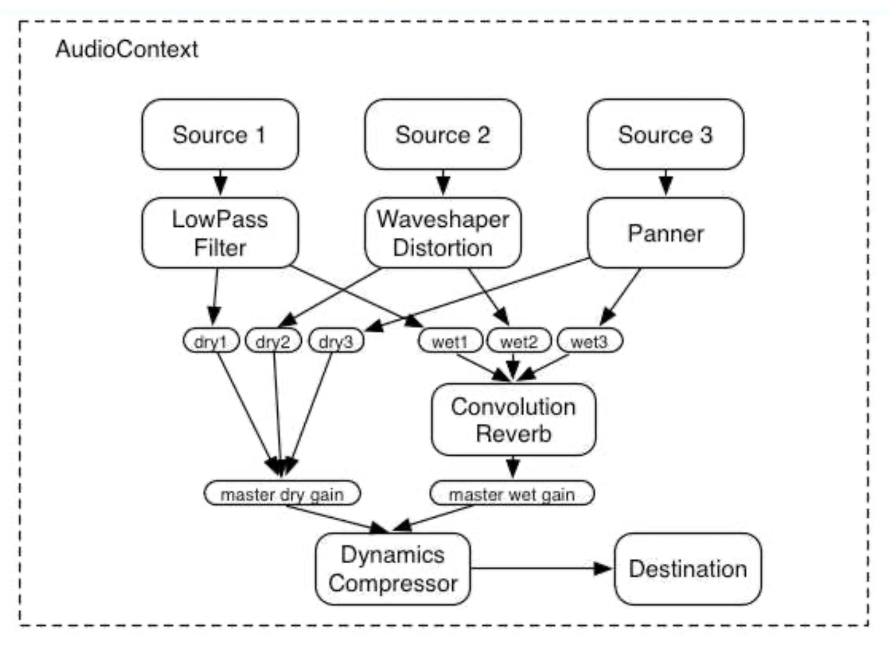

# Web Audio API - Introduction

<!-- In this article, we will just present some general principles of the Web Audio API. -->
<!-- ## Introduction -->

The Web Audio API, which defines a high-level JavaScript _Application Programming Interface_ (API) for processing and synthesizing audio, is specification which has reach the status of _Candidate Recommendation_ for the W3C:

> A Candidate Recommendation is a document that  W3C believes has been widely reviewed and satisfies the Working Group’s technical requirements. W3C publishes a Candidate Recommendation to gather implementation experience.

This means that while not completely accepted as Web standard, the Web Audio API has already gone quite far into the long process of W3C standardization. In practical terms, the Web Audio API can be considered stable and [can be used in most recent Web browsers](https://caniuse.com/audio-api), such as Google Chrome, Firefox or Safari.

<!-- ## General architecture -->

The Web Audio API specification, which you can read online if you are adventurous [https://www.w3.org/TR/webaudio/](https://www.w3.org/TR/webaudio/), defines the Web Audio API as follow:

> This specification describes a high-level Web API for processing and synthesizing audio in web applications. The primary paradigm is of an audio routing graph, where a number of AudioNode objects are connected together to define the overall audio rendering. The actual processing will primarily take place in the underlying implementation (typically optimized Assembly / C / C++ code), but direct script processing and synthesis is also supported.

The API (for _Application Programming Interface_), has been conceived to support a wide range of use cases, such as videos games or interactive applications, enables for example, to create modular and dynamic audio graphs, to create automations on parameters, to process an audio stream such as the one from the microphone, or for more advanced use cases, to create new audio nodes running audio processing defined by the user.

*Illustration from the Web Audio API specification*

As examplified above, The API defines a model of modular routing that is rather similar to the ones defined in popular computer music environments such as Max or PureData. More precisely, inside a given `AudioContext`, some `AudioNode`s can be created and connected together to form a graph whose output is the `AudioDestination` (or more simply your speakers)

<!-- ## Hands-on -->

Now that we seen some of the basic principles of the Web Audio API, let's continue with creating a small projet that will playback an audio file using the Web Audio API.
