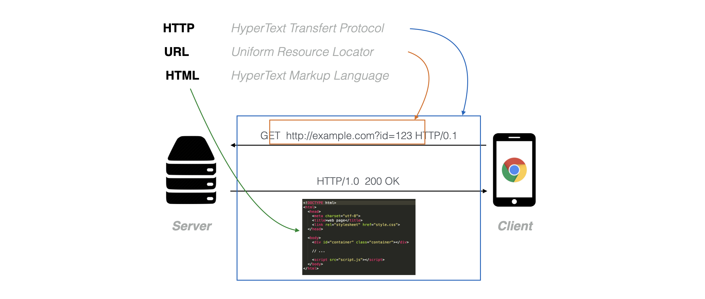

# General principles of a Web page

## Internet & Web

First thing first, let's define these two words that are often used interchangeably.

The _**Internet**_ defines a set communication protocols (e.g. TCP, UDP) which enables the interconnection of computers and of different smaller networks of computer around the world, i.e. _inter-net(work)_

::: info
- **1972** - First demonstration of ARPANET, a message sent between UCLA and Stanford
- **1983** - ARPANET is officially renamed Internet
:::

The _**Web**_ (formerly known as the _World Wide Web_) defines a set of information technologies (e.g. HTTP, HTML) that are accessed through the __Internet__.

::: info
- **1989-1992** - Developed at the CERN by T. Berners Lee et Robert Caillau 
- **1993** - the CERN opens the technologies to the public
:::

In other words, the _Internet_ is the infrastructure while the _Web_ is served on top of that infrastructure (in the same way as e.g. emails are served on top of the _Internet_).

## Clients & Servers

Another important set of concepts to understand when working with Web technologies is the idea of _**clients**_ and _**servers**_

<!-- https://www.baeldung.com/cs/client-vs-server-terminology -->

A _**server**_ is a piece of software or hardware that respond to request to serve specific services to its clients. It important to understand that the idea of _server_ is more the definition a role inside a software architecture rather than an actual fonction. Indeed, there are many kind of server such as Web servers, domain name servers, or mail servers that everyone uses everyday when using Internet.

A _**client**_ is a program that connects to a server to access its service. For example, a **_Web browser_**, such as Firefox or Google Chrome, is a client program that connects to Web servers to access to Web informations and applications.



## Programming Languages

As stated above our access to the Web is mediated by Web browsers, which are responsible for:

1. Requesting resources to Web servers through Uniform Resource Locators (URL, e.g. [https://www.ircam.fr](https://www.ircam.fr)).
2. Downloading the files associated to the URLs.
3. Interpreting these files to display the interface with which the user interacts with in the Web browser window.


Aside resources such as images, videos or soundfile, the browser generally download and interpret file that contain code which is interpreted and executed by the Web browser. The programming languages that Web browsers are able to understand are three in number: _HTML_, _CSS_ and _JavaScript_.

The _**HTML**_ for _Hypertext Markup Language_ is, as its name indicates, a markup language that allows to describe the structure of a document and, importantly, to make links to other document. As show in the example above, HTML provides a number of __tags__ – e.g. `<h1>` which descibes a 1rst level title (or "head"), `<p>` which describe a "paragraph", etc. – that allows to describe the structure of your document:

```html
<h1>This is a title</h1>
<p>
    and a paragraph with a <a href="https://developer.mozilla.org/">link</a> 
    to the best documentation website on Web technologies
</p>
```

which will be interpreted by the browser as the following:

<iframe style="height: 130px;" src="../assets/general-principles/html-example.htm"></iframe>

The _**CSS**_ for _Cascading Style Sheets_ is a language that allows to describe how the _HTML_ document is presented. Or in other terms to make it a bit more beautiful than what you have seen above.

For example if we apply the following CSS rules to the HTML tags we just seen before:

```css
h1 {
    font-family: arial;
    font-size: 20px;
    color: steelblue;
}
p {
    font-family: arial;
}

a {
    font-style: italic;
    color: #454545;
}
```

The presentation of the page, which is defined by the same HTML structure and content, will now appear as:

<iframe style="height: 110px;" src="../assets/general-principles/css-example.htm"></iframe>

Finally, _**JavaScript**_ provide a full featured programming language which allows to add interactivity to your Web page. For example, it allows you react to some user events, e.g. click on a button, get some information from a remote Web server without refreshing the page, or for what interest us in these tutorials, to make audio synthesis using the [Web Audi API](https://www.w3.org/TR/webaudio/). 

Here is simple example showing how you can react to a user interaction to make some sound:

```html
<button>Click Me!</button>
<script>
// get a reference to the HTML button define above
const button = document.querySelector('button');
let audioContext = null;
// listen for a click from the user
button.addEventListener('click', async () => {
  // creates the audio context on first click
  if (!audioContext) {
    audioContext = new AudioContext;
    await audioContext.resume();
  }

  // create an oscillator with (almost) random frequency
  const osc = audioContext.createOscillator();
  osc.connect(audioContext.destination);
  osc.frequency.value = 100 * (Math.floor(Math.random() * 20)) + 1;
  osc.start();
});
</script>
```

<iframe style="height: 40px;" src="../assets/general-principles/js-example.htm"></iframe>

::: tip
To stop the sound, just reload the Web page with `Cmd+R` on Mac or `Ctrl + R` on windows. 
This is a shortcut you will need a lot while developping Web pages!
:::

## Conclusion

Now that you have a better understanding of the different technologies involved in creating Web pages, let's continue with preparing your system to have a working development environment.


