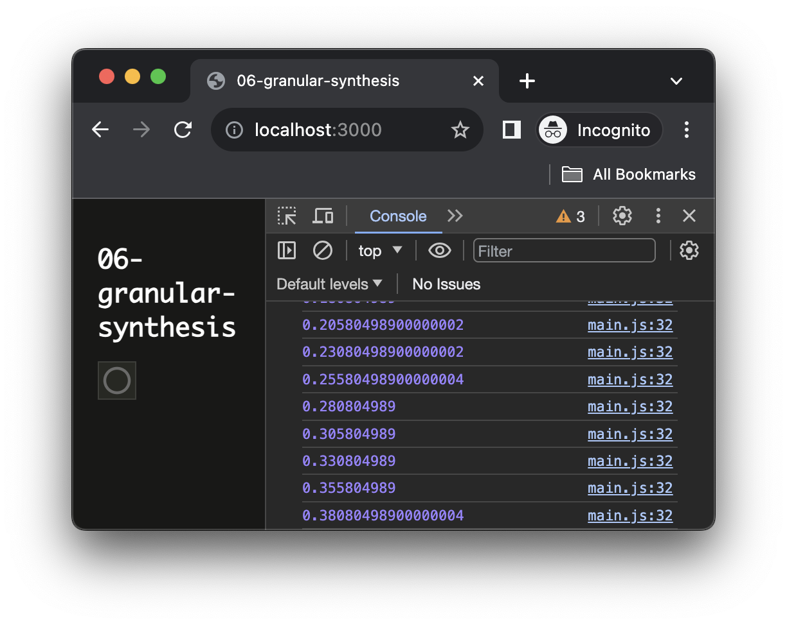

<script setup>
import { withBase } from 'vitepress'
</script>

# Granular Synthesis

In this tutorial, you will learn how to implement a granular synthesizer using the Web Audio API leveraging on the lookahead scheduling technique we seen in the previous tutorial.

### Related Documentation

- [Granular Synthesis - Wikipedia](https://en.wikipedia.org/wiki/Granular_synthesis)
- [`AudioBufferSourceNode.start`](https://developer.mozilla.org/docs/Web/API/AudioBufferSourceNode/start)
- [`AudioBufferSourceNode.playbackRate`](https://developer.mozilla.org/docs/Web/API/AudioBufferSourceNode/playbackRate) 
- [`<sc-dragndrop>`](https://ircam-ismm.github.io/sc-components/sc-dragndrop)

## General principles

Granular synthesis is sound synthesis technique that consists in cutting a audio files in small pieces of sound of around 5 to 200ms called **_grains_**. These grains are then played back and layered to reconstruct a new sound. Each grain can also be manipulated independetly by modifying for example their pitch, volume, etc.


## Implement the synthesis engine

### Scaffold the project

```sh
cd ~/Desktop/webaudio-tutorials
npx @ircam/create@latest 06-granular-synthesis
cd 06-granular-synthesis
npx serve
```

### Import a library for scheduling

First, let's just import a library that will provide us with a much more robust version of the scheduler we implemented in last tutorial, while being build on the same principles:

```js {2}
// ./main.js
import { html, render } from 'https://unpkg.com/lit-html';
import { Scheduler } from 'https://unpkg.com/@ircam/sc-scheduling@0.1.6';
import 'https://unpkg.com/@ircam/sc-components@latest';
```

Replace the default sample in `./assets/sample.wav` with another longer one, and evetually modify the `loadAudioBuffer` first argument to match you file name:

```js 
// ./main.js
const buffer = await loadAudioBuffer('./assets/sample.wav', audioContext.sampleRate); // [!code --]
const buffer = await loadAudioBuffer('./assets/hendrix.wav', audioContext.sampleRate); // [!code ++]
```

::: info
The sample used in the tutorial can be downloaded <a :href="(withBase('/static-assets/granular-synthesis-samples.zip'))">here</a>
:::

### Implement the audio engine

Let's start with defining the new class which will be our granular engine:

```js
const buffer = await loadAudioBuffer('./assets/sample.wav', audioContext.sampleRate);

class GranularSynth {
  constructor(audioContext, buffer) {
    this.audioContext = audioContext;
    this.buffer = buffer;

    // time interval between each grain
    this.period = 0.025;
    // duration of each grain
    this.duration = 0.1;
    // position of the grain in the buffer
    this.position = 0;

    // create an output gain on wich will connect all our grains
    this.output = this.audioContext.createGain();
    // bind the render method so that we don't the instance context
    this.render = this.render.bind(this);
  }

  render(currentTime) {
    console.log(currentTime);
    // ask to be called at time of next grain
    return currentTime + this.period;
  }
}
```


For now, this doesn't make any sound, but let's see how to make it work with the scheduler:

```js
// ./main.js
class GranularSynth {
    // ...
}

// create a new scheduler, in the audioContext timeline
const scheduler = new Scheduler(() => audioContext.currentTime);
// create out granular synth and connect it to audio destination
const granular = new GranularSynth(audioContext, buffer);
granular.output.connect(audioContext.destination);
// register the synth into the scheduler and start it now
scheduler.add(granular.render, audioContext.currentTime);
```

If you reload the page and open the console, you should the start time of the grains displayed in the console:



Let's then continue with implementing our render method:

```js
// ./main.js
class GranularSynth {
  constructor(audioContext, buffer) {
    // ...
  }

  render(currentTime) {
    // create our evenvelop gain
    const env = this.audioContext.createGain();
    // connect it to output
    env.connect(this.output);
    // schedule the fadein and fadeout
    env.gain.value = 0;
    env.gain.setValueAtTime(0, currentTime);
    env.gain.linearRampToValueAtTime(1, currentTime + this.duration / 2);
    env.gain.linearRampToValueAtTime(0, currentTime + this.duration);

    // create the source that will play our grain
    const src = this.audioContext.createBufferSource();
    src.buffer = buffer;
    // connect to output
    src.connect(env);
    // play the grain at given position and for given duration
    src.start(currentTime, this.position);
    src.stop(currentTime + this.duration);

    // increment position so that we read the file at speed divided by 4
    this.position += this.period / 4;
    // make sure we don't try to pick a grain outside the buffer
    if (this.position > this.buffer.duration - this.duration) {
      this.position = 0;
    }

    // ask to be called at time of next grain
    return currentTime + this.period;
  }
}
```

The code is finally quite simple as we just create an audio buffer source node, pipe it into gain with a simple envelop automation, which is itself connected to the output node of the synth. At the end of the render method, we just update the position of the next grain so that the source file is played back at a portion of its normal speed. 

When you reload the page you should now ear you GranularSynth in action!

## Adding controls

Let's now finalize our application to add control interfaces to change the parameters of the synthesis in real-time.

```js {4-33}
// ./main.js
render(html`
  <h1>06-granular-synthesis</h1>
  <div>
    <sc-text>Period</sc-text>
    <sc-slider
      min="0.005"
      max="0.1"
      value=${granular.period}
      @input=${e => granular.period = e.detail.value}
      number-box
    ></sc-slider>
  </div>
  <div>
    <sc-text>Duration</sc-text>
    <sc-slider
      min="0.01"
      max="0.5"
      value=${granular.duration}
      @input=${e => granular.duration = e.detail.value}
      number-box
    ></sc-slider>
  </div>
  <div>
    <sc-text>Position</sc-text>
    <sc-slider
      min="0"
      max=${buffer.duration}
      value=${granular.position}
      @input=${e => granular.position = e.detail.value}
      number-box
    ></sc-slider>
  </div>
`, document.body);
```

And change our synth so that the position is not updated automatically but only controlled by the slider:

```js
// ./main.js
class GranularSynth {
  constructor(audioContext, buffer) {
    // ...
  }

  render(currentTime) {
    // ...

    // increment position so that we read the file at speed divided by 4 // [!code --]
    this.position += this.period / 4; // [!code --]
    // make sure we don't try to pick a grain outside the buffer // [!code --]
    if (this.position > this.buffer.duration - this.duration) { // [!code --]
      this.position = 0; // [!code --]
    } // [!code --]

    // ask to be called at time of next grain
    return currentTime + this.period;
  }
}
```

If you play a bit with the controls, you can ear that with very low `period` values, the resulting synthesis produces pitched audible artefacts, which might not be desirable. This is due to the fact these values are so small that they start to be audible on their own, e.g. a period of 0.005 ms corresponds to 200 Hz.

A way to remove these artifacts is to add some jitter, or noise on the scheduling of the grain:

```js
// ./main.js
class GranularSynth {
  constructor(audioContext, buffer) {
    // ...
  }

  render(currentTime) {
    const jitter = Math.random() * 0.002; // [!code ++]
    const grainTime = currentTime + jitter; // [!code ++]
    // create our evenvelop gain
    const env = this.audioContext.createGain();
    // connect it to output
    env.connect(this.output);
    // schedule the fadein and fadeout
    env.gain.value = 0;
    env.gain.setValueAtTime(0, currentTime); // [!code --]
    env.gain.setValueAtTime(0, grainTime); // [!code ++]
    env.gain.linearRampToValueAtTime(1, currentTime + this.duration / 2); // [!code --]
    env.gain.linearRampToValueAtTime(1, grainTime + this.duration / 2); // [!code ++]
    env.gain.linearRampToValueAtTime(0, currentTime + this.duration); // [!code --]
    env.gain.linearRampToValueAtTime(0, grainTime + this.duration); // [!code ++]

    // create the source that will play our grain
    const src = this.audioContext.createBufferSource();
    src.buffer = buffer;
    // connect to output
    src.connect(env);
    // play the grain at given position and for given duration
    src.start(currentTime, this.position); // [!code --]
    src.start(grainTime, this.position); // [!code ++]
    src.stop(currentTime + this.duration); // [!code --]
    src.stop(grainTime + this.duration); // [!code ++]

    // ask to be called at time of next grain
    return currentTime + this.period;
  }
}
```

Congrats! Your granular synthesizer is now fully working

## Going further

To improve the application, you could for example add some controls over:
- The pitch of each grain, using the [`AudioBufferSourceNode.playbackRate`](https://developer.mozilla.org/docs/Web/API/AudioBufferSourceNode/playbackRate) rate param
- Allow users to use their own audio file, by providing a way to drag and drop it directly into the interface, cf. [`<sc-dragndrop>`](https://ircam-ismm.github.io/sc-components/sc-dragndrop)

## Conclusion

In this tutorial, you have learned how to leverage on the scheduling technique we have seen in the previous tutorial to build your own granular synthesizer.

In the next tutorial, we will continue with the exploration of the scheduling by implementing a simple step sequencer.


