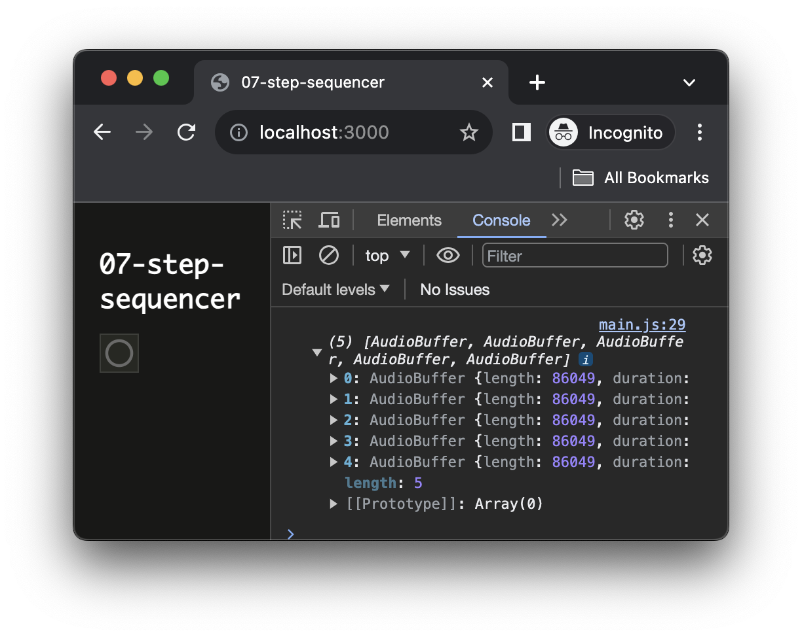

<script setup>
import { withBase } from 'vitepress'
</script>

# Building a step sequencer

In this third tutorial about scheduling, we will build a simple step sequencer. While we won't see much more new

### Related documentation

- [`Array`]
- [`StereoPannerNode`]
- [`sc-matrix`]

## Loading the sound files

Let's first scaffold and launch a new application:

```sh
cd ~/Desktop/webaudio-tutorials
npx @ircam/create@latest 07-step-sequencer
cd 07-step-sequencer
npx serve
```

Then let's put some samples in the `./assets` directory. 

::: info
The set of samples used in the tutorial can be downloaded <a :href="(withBase('/static-assets/step-sequencer-samples.zip'))">here</a>
:::


Then let's load all these files and store them into a list of buffers:

```js {5-24}
// ./main.js
const audioContext = new AudioContext();
await resumeAudioContext(audioContext);

const samples = [
  './assets/hh.wav',
  './assets/clap.wav',
  './assets/rimshot.wav',
  './assets/snare.wav',
  './assets/kick.wav',
];

const buffers = [];

// loop through all our sample pathnames and
for (let i = 0; i < samples.length; i++) {
  const pathname = samples[i];
  // load the corresponding audio buffer
  const buffer = await loadAudioBuffer(pathname, audioContext.sampleRate);
  // populate the `buffers` list with the corresponding buffer
  buffers[i] = buffer;
}

console.log(buffers);
```

When you reload the page, you should now see the list of the loaded audio buffers logged into the console:



## Data structure for the score

Now that our buffers are loaded and ready to use, let's create a data structure that will contain the "score" of our step sequencer. 

Our score is defined as follow: for each buffer we define a list (i.e. an `Array`) of values with length equal to the number of steps (e.g. 16) we want, for a given step if the value is `0` the sound wont be played, and if it is `1` the sound is played. For example, if the score of the kick track is:

```js
[1, 0, 0, 0, 1, 0, 0, 0, 1, 0, 0, 0, 1, 0, 0, 0]
```

The kick sample will be played at step 1, 4, 8 and 12.

Then we can pack the score for each track into a list of tracks, where the index of track score correspond to the index of the buffer in our `buffers` list:

```js
const score = [
    [0, 1, 0, 1, 0, 1, 0, 1, 0, 1, 0, 1, 0, 1, 0, 1], // "hh" track
    [0, 0, 0, 0, 0, 0, 0, 1, 0, 0, 0, 0, 0, 1, 0, 1], // "clap" track
    [0, 0, 0, 0, 0, 0, 0, 0, 0, 0, 0, 0, 0, 0, 0, 0], // "rimshot" track
    [0, 0, 1, 0, 0, 0, 1, 0, 0, 0, 1, 0, 0, 0, 1, 0], // "snare" track
    [1, 0, 0, 0, 1, 0, 0, 0, 1, 0, 0, 0, 1, 0, 0, 0], // "kick" track
]
```

Let's then write the code to intialize our score:

```js {4-20}
// ./main.js
console.log(buffers);

const numTracks = buffers.length; // one track per audio buffer
const numSteps = 16; // the number of steps per track

const score = [];
// create each track and push it into our score
for (let i = 0; i < numTracks; i++) {
  const track = [];
  // initialize the track with zeros
  for (let j = 0; j < numSteps; j++) {
    track[j] = 0;
  }
  // track is now: [0, 0, 0, 0, 0, 0, 0, 0, 0, 0, 0, 0, 0, 0, 0, 0]
  // push it into the score
  score[i] = track;
}

console.log(score);
```

When reloading the page you should now see the score logged into the console:


## Building the track player

To develop our audio player, let's start with importing the scheduler and to temporarily replacing our score with a static one. This will allow us to develop our audio engine without having to create a graphical user interface (GUI) to interact with the score.

```js {3,8-30}
// ./main.js
import { html, render } from 'https://unpkg.com/lit-html';
import { Scheduler } from 'https://unpkg.com/@ircam/sc-scheduling@0.1.6';
import 'https://unpkg.com/@ircam/sc-components@latest';

// ...

// const score = [];
// // create each track and push it into our score
// for (let i = 0; i < numTracks; i++) {
//   const track = [];
//   // initialize the track with zeros
//   for (let j = 0; j < numSteps; j++) {
//     track[j] = 0;
//   }
//   // track is now: [0, 0, 0, 0, 0, 0, 0, 0, 0, 0, 0, 0, 0, 0, 0, 0]
//   // push it into the score
//   score[i] = track;
// }

// fake score for developping the audio engine
const score = [
    [0, 1, 0, 1, 0, 1, 0, 1, 0, 1, 0, 1, 0, 1, 0, 1], // "hh" track
    [0, 0, 0, 0, 0, 0, 0, 1, 0, 0, 0, 0, 0, 1, 0, 1], // "clap" track
    [0, 0, 0, 0, 0, 0, 0, 0, 0, 0, 0, 0, 0, 0, 0, 0], // "rimshot" track
    [0, 0, 1, 0, 0, 0, 1, 0, 0, 0, 1, 0, 0, 0, 1, 0], // "snare" track
    [1, 0, 0, 0, 1, 0, 0, 0, 1, 0, 0, 0, 1, 0, 0, 0], // "kick" track
]

console.log(score);
```

Then let's create our `TrackEngine` class, this class will be responsible for rendering one single track of our score.

```js {4-35}
// ./main.js
console.log(score);

class TrackEngine {
  constructor(audioContext, buffer, track, BPM) {
    this.audioContext = audioContext;
    this.buffer = buffer;
    this.track = track;
    this.BPM = BPM;
    // current step in the score
    this.step = 0;
    // ouput node so that we can connect to the outside world
    this.output = this.audioContext.createGain();
    // bind the render method so that we don't loose the context
    this.render = this.render.bind(this);
  }

  render(currentTime) {
    // check if the track is active at this given step
    const isActive = this.track[this.step] === 1;
    // if it is active, let's play the buffer
    if (isActive) {
      const src = this.audioContext.createBufferSource();
      src.buffer = this.buffer;
      src.connect(this.output);
      src.start(currentTime);
    }

    // update the current step for next call
    const numSteps = this.track.length;
    this.step = (this.step + 1) % numSteps;
    // return the next time according to the BPM
    return currentTime + 60 / this.BPM;
  }
}
```

Finally, let's create our scheduler and instantiate all our tracks:

```js
// ./main.js
const trackEngines = []; // to store our TrackEngine instances
const BPM = 180; // default BPM
// create a scheduler running in audio timeline
const scheduler = new Scheduler(() =>  audioContext.currentTime);
// start all track on the next second
const startTime = Math.ceil(audioContext.currentTime);

// for each track in the score
for (let i = 0; i < numTracks; i++) {
  // pick buffer and track according to current index
  const buffer = buffers[i]
  const track = score[i];
  // create the track engine and connect it to audio destination
  const trackEngine = new TrackEngine(audioContext, buffer, track, BPM);
  trackEngine.output.connect(audioContext.destination);
  // add to scheduler and store into the trackEngines list
  scheduler.add(trackEngine.render, startTime);
  trackEngines.push(trackEngine);
}
```

If you reload now, you should now ear this quite nice drum:

<audio controls loop :src="withBase('/static-assets/step-sequencer.wav')" />

## Creating the user interface

Now that our synthesizer is working let's create a user interface to be able to interact with our score:

```js {4-6}
// ./main.js
render(html`
  <h1>07-step-sequencer</h1>
  <sc-matrix
    .value=${score}
  ></sc-matrix>
`, document.body);
```

Done :)


This works that simply because in JavaScript, `Array`s are always passed by reference, which means that both the GUI and the `TrackEngine`s share a reference to the same object. Therefore any change made on the score by the `<sc-matric>` can automatically be seen by the corresponding `TrackEngine`.

Finally, let's just remove our "fake" score to replace it back with the empty one generated from the code:

```js
const numTracks = buffers.length; // one track per audio buffer
const numSteps = 16; // the number of steps per track

const score = []; // [!code ++]
// create each track and push it into our score // [!code ++]
for (let i = 0; i < numTracks; i++) { // [!code ++]
  const track = []; // [!code ++]
  // initialize the track with zeros // [!code ++]
  for (let j = 0; j < numSteps; j++) { // [!code ++]
    track[j] = 0; // [!code ++]
  } // [!code ++]
  // track is now: [0, 0, 0, 0, 0, 0, 0, 0, 0, 0, 0, 0, 0, 0, 0, 0] // [!code ++]
  // push it into the score // [!code ++]
  score[i] = track; // [!code ++]
} // [!code ++]

// fake score for developping the audio engine  // [!code --]
const score = [ // [!code --]
    [0, 1, 0, 1, 0, 1, 0, 1, 0, 1, 0, 1, 0, 1, 0, 1], // "hh" track  // [!code --]
    [0, 0, 0, 0, 0, 0, 0, 1, 0, 0, 0, 0, 0, 1, 0, 1], // "clap" track // [!code --]
    [0, 0, 0, 0, 0, 0, 0, 0, 0, 0, 0, 0, 0, 0, 0, 0], // "rimshot" track // [!code --]
    [0, 0, 1, 0, 0, 0, 1, 0, 0, 0, 1, 0, 0, 0, 1, 0], // "snare" track // [!code --]
    [1, 0, 0, 0, 1, 0, 0, 0, 1, 0, 0, 0, 1, 0, 0, 0], // "kick" track // [!code --]
] // [!code --]
 // [!code --]
console.log(score);
```

Thanks to this dynamic score, if you add a new sample ro change the number of steps, all the application will change dynamically without further work (which is quite nice...)

## Panning the tracks

In this last step, we will just add a stereo panning effect on our tracks to show you how simple it is regarding the architecture of our code.

```js
for (let i = 0; i < numTracks; i++) {
  // pick buffer and track according to current index
  const buffer = buffers[i]
  const track = score[i];
  // create the track engine and connect it to audio destination
  const trackEngine = new TrackEngine(audioContext, buffer, track, BPM);
  trackEngine.output.connect(audioContext.destination); // [!code --]
  // create a stereo panner node // [!code ++]
  const panner = audioContext.createStereoPanner(); // [!code ++]
  // randomize left (-1) / right (1) for all tracks // [!code ++]
  panner.pan.value = Math.random() * 2 - 1; // [!code ++]
  // connect panner in between trackEngine and destination // [!code ++]
  trackEngine.output.connect(panner); // [!code ++]
  panner.connect(audioContext.destination); // [!code ++]

  // add to scheduler and store into the trackEngines list
  scheduler.add(trackEngine.render, startTime);
  trackEngines.push(trackEngine);
}
```

## Going further

There are several ways you can improve the application, for example you could:
- Add a control for panning each track independently
- Add other effects
- Add a visual feedback to display the current step
- Add some control over the BPM
- Generate a default score according to the number of tracks and number of steps

## Conclusion

In this tutorial, you have learned how to build a simple step sequencer, using some pattern that will allow you to simply make you application evolve. 

This is all for this serie on timing and scheduling.


