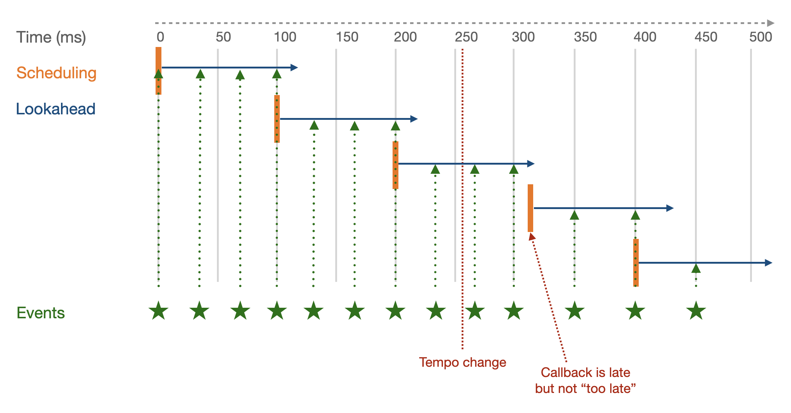

<script setup>
import { withBase } from 'vitepress'
</script>

# Timing and Scheduling

In this tutorial we will focus on one of the most important aspects of any audio application, that is how to organize events in time. More precisely, we will review the possibilities and possible limitations of functionalities provided by the Web Audio API, and we will learn how these limitations can be mitigated by using a lookahead scheduler.

### Related documentation

- [`AudioContext.currentTime`](https://developer.mozilla.org/docs/Web/API/BaseAudioContext/currentTime)
- [`A tale of two clocks - C. Wilson`](https://web.dev/articles/audio-scheduling)

## Clocks and times

As we have seen in previous tutorials, the Web Audio API already provides us a clock and some ways of controlling some timing aspects over playback and synthesis.

Let's first consider the clock provided by the Web Audio API:

```js
const now = audioContext.currentTime;
```

The `currentTime` attribute of the `AudioContext` gives us the time in seconds since the `AudioContext` has been resumed. This clock is computed as: `number of samples / sample rate` and is therefore accurate in terms of audio time. 

However, it has one major limitation: it is re-computed once at each block of processing (i.e. at block rate or `k-rate`) or every 128 samples. For example, at 44.1kHz this means that it will advance by steps of `128 / 44100` seconds or ~2.9 milliseconds. In practical terms this means that accessing `audioContext.currentTime` will always give you the time of the next block that will be computed.

In terms of scheduling, we have already seen different methods that allow us to achieve such thing. For example we can `start` and `stop` sources at a given time:

```js
const src = audioContext.createBufferSourceNode();
src.buffer = buffer;
src.connect(audioContext.destination);
// start the source in 1 sec and stop it in 3 seconds from now
const now = audioContext.currentTime;
src.start(now + 1);
src.stop(now + 3);
```

Additionally, all automation methods of `AudioParams` can be scheduled in a similar way:

```js
const envelop = audioContext.createGain();
envelop.gain.value = 0; // set the gain default value to 0
// create an envelop that will start in 1 second and end in 3 seconds
const now = audioContext.currentTime;
 // create at start automation point
envelop.setValueAtTime(0, now + 1);
 // ramp linearly to 1 in 20 ms
envelop.linearRampToValueValueAtTime(1, now + 0.02);
// ramp exponetialy to (almost) 0 at second 3 after now
envelop.exponentialRampToValueAtTime(0.001, now + 3);
```

::: tip
The `exponentialRampToValueAtTime` will throw an `Error` if it's target value is 0, because it is undefined mathematically. A practical way of finding a good value is to remember that this correspondence between linear and dB values:
- 1 -> 0 dB
- 0.1 -> -20dB
- 0.01 -> -40dB
- 0.001 -> -60dB
- ...
In the example above, this means that the target we set correspond to -80 dB which low enough so that the corresponding source can be stop without earring any discontinuity.
:::

All these methods are indeed very practical and powerful, as they allow us to schedule events, for example a metronome, very precisely at the sub sample level:


However, such approach suffers one major limitation: we have to know every single event that will occur in our score (or application) to schedule them all at once in a very precise way. Indeed, this is not very suited for more interactive or reactive applications.

## Principles of a lookahead scheduler

::: info
The concepts presented in this section are mostly a digest of the article ["A Tale of two Clocks" by Chris Wilson](https://web.dev/articles/audio-scheduling). We highly recommend you to read this article and come back to the tutorial afterwards.
:::

To workaround this limitation, one possible way is two periodically check if what have things to schedule in the near future (the "lookahead") until we check it again. As such, it becomes possible to react to external events such as a change of tempo:


Which we could write in (pseudo) JavaScript code:

```js
const lookahead = 0.1; // in second
// a function that looks for events between now and now + lookahead
// and schedule all audio events that have been found
function tick() {
    const now = audioContext.currentTime;
    const events = findEventsBetween(now, now + lookahead);
    events.forEach(event => scheduleAudioEvent(event));
}

// Execute the `tick` function every 100 ms
// note that the `setInterval` period (2nd argument) is defined in ms
setInterval(tick, lookahead * 1000); 
```

With such approach, we can maintain and modify a list of event, in which our `findEventsBetween` function will look for events, and react quite rapidly to any change in the list as only the events registered in the next 100 ms are already scheduled in terms of audio rendering.

So theoretically, we are all good! However with such naive approach, we just fall into another trap. Indeed, as we have seen in the previous tutorial, the JavaScript timing functions: `setInterval` and `setTimeout` are not accurate enough to precisely schedule audio events. And furthermore, as we have just seen, the `audioContext.currentTime` is not continuous neither... Thus this is very possible to end up with a situation such as:


Where an events is dropped (start in red) because the callback has been called too late!

To fix this issue we thus need to decouple the rate at which the callback is called (i.e. its period) and the lookahead, making sure that the period is always lower than the lookahead. With such strategy, we can thus mitigate the accuracy of the `setInterval` and recover if the callback is not called precisely at the expected time (which **_will_** be the case):



In our pseudo code implementation, that would mean:

```js
// define `lookahead` and `period` such as period < lookahead
const lookahead = 0.15; // in second
const period = 0.1; // in second

// Schedule events between now and now + lookahead
function tick() {
    const now = audioContext.currentTime;
    const events = findEventsBetween(now, now + lookahead);
    events.forEach(event => scheduleAudioEvent(event));
}

// Execute the `tick` at `period`
setInterval(tick, period * 1000); 
```

Now that we have a basic understanding of what lookahead schedulers are and why we need them in interactive applications, let's implement a simple but working one.

## Implement a simple lookahead scheduler

### Scaffold project

So let's first scaffold a new project:

```sh
cd ~/Desktop/webaudio-tutorials
npx @ircam/create@latest 05-lookahead-scheduler
cd 05-lookahead-scheduler
npx serve
```

### Priority queue

A [priority queue](https://en.wikipedia.org/wiki/Priority_queue) is a data structure where each element has an associated priority and that guarantees that elements with higher priority are retrieved before elements with lower priority. In our case, when looking for the next event to be scheduled, we want to be sure that this the event which is scheduled in the closest future.

We won't go into how to implement such data structure in an efficient way and will just use a list of event sorted according to their associated time. What we want want to be able to do with this queue is:

- add an event with an associated priority (i.e. a time)
- read the item with the highest priority (i.e. smallest time)
- remove the item with highest priority (when it has been scheduled)

So let's go with implementing the queue:

```js {7-38}
// ./main.js
const audioContext = new AudioContext();
await resumeAudioContext(audioContext);

const buffer = await loadAudioBuffer('./assets/sample.wav', audioContext.sampleRate);

class PriorityQueue {
  constructor() {
    // array in which we store the elements of the queue
    this.queue = [];
  }

  // add an event with it's associated priority into the queue
  add(event, time) {
    // pack `event` and `time` into a single data structure
    const element = { event, time };
    // add the data structure into the queue
    this.queue.push(element);
    // sort the queue so that the element with highest priority (i.e. smallest time)
    // is at the beginning of the list
    this.queue.sort((a, b) => a.time <= b.time ? -1 : 1);
  }

  // return the event with highest priority or `null` if the queue is empty
  head() {
    if (this.queue.length > 0) {
      return this.queue[0];
    } else {
      return null;
    }
  }

  // delete the first element of the queue
  deleteHead() {
    this.queue.shift();
  }
}
```

Then, we can implement our `LookaheadScheduler`:

```js
// ./main.js
class LookaheadScheduler {
  constructor() {
    this.priorityQueue = new PriorityQueue();
    this.period = 0.05;
    this.lookahead = 0.1;

    // make sure the tick method is called with the right `this` context,
    // whatever its call context (welcome to JavaScript :)
    this.tick = this.tick.bind(this);
    // launch the periodic `tick` call
    setInterval(this.tick, this.period * 1000);
  }

  add(event, time) {
    // insert the event, time pair into the queue
    this.priorityQueue.add(event, time);
  }

  // This function is executed by the `setInterval` every 50 ms.
  // This is where all the magic happens
  tick() {
    // get the current time of the audio context and the current head of the queue
    const now = audioContext.currentTime;
    let head = this.priorityQueue.head();

    // unstack the queue while the head is in the time frame defined by the lookahead
    while (head && head.time < now + this.lookahead) {
      // the head will be processed so we can remove it from the queue
      this.priorityQueue.deleteHead();
      // pick the time and event from the head
      // the time of the event is not `now`, it is somewhere between now and now + lookahead
      const time = head.time;
      const event = head.event;

      // Execute the event giving it its time as argument.
      // If the event returns a new time, i.e. it wants to be called again later,
      // we can re-insert it right away into the queue.
      const nextTime = event(time);

      if (nextTime) {
        this.priorityQueue.add(event, nextTime);
      }

      // pick the next event in the queue and check if it is in the lookahead
      head = this.priorityQueue.head();
    }
  }
}
```

Finally let's just implement a simple metronome that we will register into the scheduler, and everything together:

```js
const BPM = 60;

function metro(currentTime) {
  console.log(currentTime);
  // play some sound at `currentTime`
  const src = audioContext.createBufferSource();
  src.buffer = buffer;
  src.connect(audioContext.destination);
  src.start(currentTime);

  // return the next time we want to do something
  return currentTime + 60 / BPM;
}

// create a new LookaheadScheduler
const scheduler = new LookaheadScheduler();
// add the metronome to the scheduler, starting now
scheduler.add(metro, audioContext.currentTime);
```

If you reload the page, you should now ear a very nice metronome at 60 BPM:

<audio controls loop :src="withBase('/static-assets/metronome-with-scheduler.m4a')" />

Congrats! You have implemented a very simple yet working lookahead scheduler

### Going further

Of course, this scheduler is very simple and misses a lot of functionality, but you have a basis to build upon if you which. For example you could

- Implement the logic to remove a scheduled event from the queue, e.g. to stop the metronome and more advanced synthesis engine)
- Stop and restart the scheduler on demand.

You could also improve the demo by:
- Inserting the `FeedbackDelay` in the graph so that you can check that the jitter issue we add in last tutorial is now solved
- Adding some control over the BPM of the metronome.

## Conclusion

In this tutorial, you have learned the why and how of lookahead schedulers. In particular why they are needed to mitigate the lack of precision of regular JavaScript timers, and how you can implement a simple version it.

In the next tutorial, we will build upon this knowledge and tools to learn how to implement a rather powerful and versatile synthesis technique: the _granular synthesis_.
